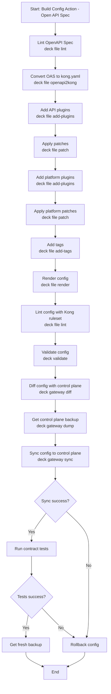

# Flight Data Team Repo

A demo repository for the Flight Data Team.

## Project Structure

### Workflows

```
.github
└── workflows
    ├── deploy-api.yaml # Deploy api to k8s
    └── promote-api.yaml # Publish api to Konnect
```

### APIs
```
apis
├── flights
│   ├── Dockerfile
│   ├── Makefile
│   ├── README.md
│   ├── api
│   │   ├── flights-server.gen.go
│   │   ├── flights.go
│   │   ├── flights_test.go
│   │   ├── models
│   │   │   └── models.gen.go
│   │   ├── models.cfg.yaml
│   │   └── server.cfg.yaml
│   ├── flights.go
│   ├── go.mod
│   ├── go.sum
│   ├── insomnia.yaml
│   ├── kong
│   │   ├── patches
│   │   │   └── patches.yaml
│   │   └── plugins
│   │       └── plugins.yaml
│   └── openapi.yaml
└── routes
    ├── Dockerfile
    ├── Makefile
    ├── README.md
    ├── api
    │   ├── models
    │   │   └── models.gen.go
    │   ├── models.cfg.yaml
    │   ├── routes-server.gen.go
    │   ├── routes.go
    │   ├── routes_test.go
    │   └── server.cfg.yaml
    ├── go.mod
    ├── go.sum
    ├── insomnia.yaml
    ├── kong
    │   ├── patches
    │   │   └── patches.yaml
    │   └── plugins
    │       └── plugins.yaml
    ├── openapi.yaml
    ├── routes.go
    └── routes_test.go
```

### K8s deployments
```
k8s
├── flights
│   ├── Chart.yaml
│   ├── templates
│   │   └── flights-api-deployment.yaml
│   └── values.yaml
└── routes
    ├── Chart.yaml
    ├── templates
    │   └── routes-api-deployment.yaml
    └── values.yaml
```

## Promote API to Konnect
To promote the API to Konnect, you need to run the `promote-api.yaml` workflow. This workflow will publish the API to Konnect and apply any necessary patches and plugins.

```bash
act --input api=flights -W .github/workflows/promote-api.yaml
```

### Flow


